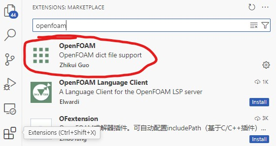
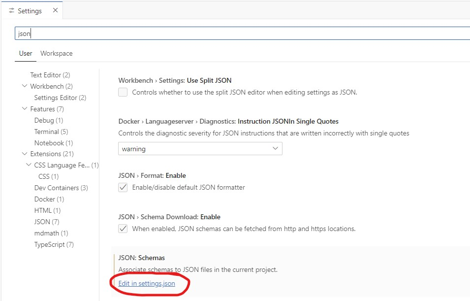
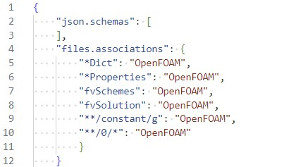

# Introduction

**Goal:** Install Visual Studio Code and adjust settings for easier OpenFOAM workflow.

---

### Step 1: Install Visual Studio Code
First, download and install the text editor [Visual Studio Code](https://code.visualstudio.com).

---

### Step 2: Associate OpenFOAM files types

On the left pane, find and install the OpenFOAM extension by Zhikui Guo.



Click the OpenFOAM extension and copy the lines.

```
"files.associations": {
    "*Dict": "OpenFOAM",
    "*Properties": "OpenFOAM",
    "fvSchemes": "OpenFOAM",
    "fvSolution": "OpenFOAM",
    "**/constant/g": "OpenFOAM",
    "**/0/*": "OpenFOAM"
    }
```

Then open the ``settings.json`` file by going File -> Preferences -> Settings. Then search for ``json`` and edit the ``settings.json`` file and add the lines:

--- 

### Step 2 continued: Associate OpenFOAM files types

<div class="multicolumn">

<div>



</div>

<div>



</div>

</div>