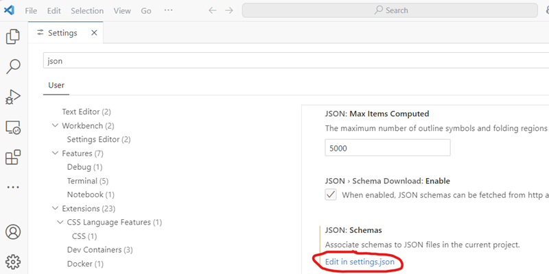

# OpenFOAM
##### Install and adjust Visual Studio Code for OpenFOAM usage

---

### Step 1: Install Visual Studio Code

We will be using Visual Studio Code (VS Code), which is a lightweight, extendable text editor. By adding extensions it integrates nicely with OpenFOAM.

**Download and install the text editor [Visual Studio Code](https://code.visualstudio.com)**

---

### Step 2: Associate OpenFOAM files types

On the left pane, find and install the OpenFOAM extension by Zhikui Guo.


Click the OpenFOAM extension and copy the lines.

```
"files.associations": {
    "*Dict": "OpenFOAM",
    "*Properties": "OpenFOAM",
    "fvSchemes": "OpenFOAM",
    "fvSolution": "OpenFOAM",
    "**/constant/g": "OpenFOAM",
    "**/0/*": "OpenFOAM"
    }
```

---

### Step 2 continued: Associate OpenFOAM files types

Then open the ``settings.json`` file by going File -> Preferences -> Settings. Then search for ``json`` and edit the ``settings.json`` file and add the lines:

<div class="multicolumn">

<div>


</div>

<div>



</div>

</div>

---